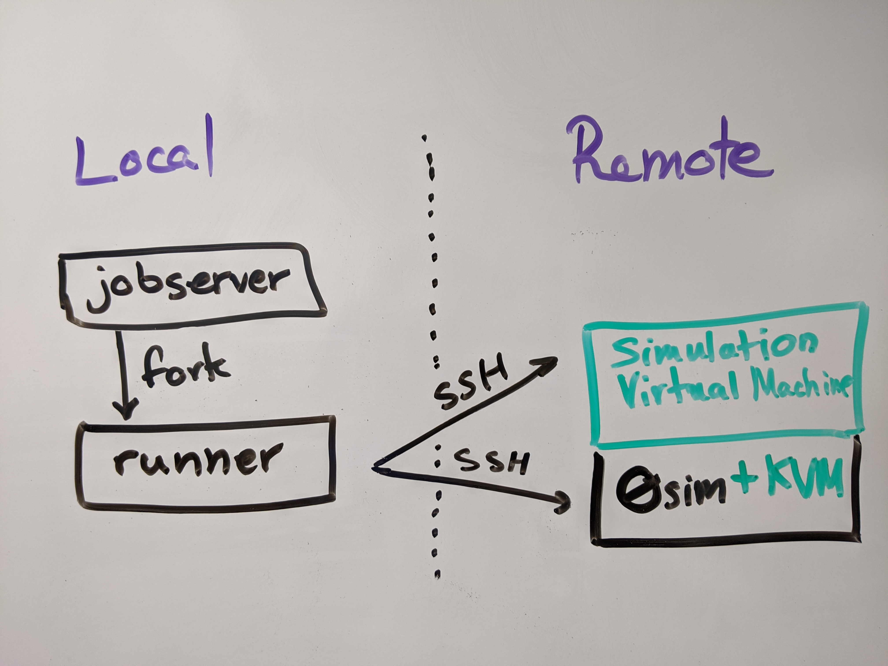

# 0sim workspace

While 0sim is usable as a standalone project, it is _a lot_ more ergonomic to
use the tooling we have built around it, which is contained in this repository.
This README documents some basic workflow and features for the use of this
tooling and of 0sim.

For more information about 0sim, see our ASPLOS 2020 paper (TODO: link) or the
README of the 0sim repo.

# Design Overview

> This section is intended to give a quick overview of how 0sim and the
> associated tools are intended to be used. Feel free to skip to [`Getting
> Started`](#getting-started) if you already know.



The suggested workflow (the one we use) is to dedicate one machine to 0sim to
run experiments. One would then drive this machine remotely from some local
machine, such as a desktop workstation, via SSH.

This repository contains a few tools we have developed and found useful in
addition to 0sim. The paper (linked above mostly covers 0sim), but we rarely
interact directly with 0sim. Instead, we drive it using the tools in this
repository: `runner` and `jobserver`.

- `runner`: executes commands on the remote machine in 0sim. `runner` takes
  care of reproducible setup and execution. It also saves a ton of time.

- `jobserver`: makes it easy to run a large number of experiments on one or
  more machines with possibly different parameters, collecting the results and
  logs in one place on the local machine for processing. The `jobserver` is
  more like a bookkeeping program that just forks off instances of `runner` to
  do the real work.

<a name="getting-started"></a>
# Getting Started

The workspace contains a bunch of tools, described in the contents section. The
most important are the `runner` and `0sim` itself. The runner drives
experiments and contains a library for writing and driving other experiments.
There is an emphasis on reproducibility and ergonomic usage.

This section contains instructions for

0. [Ensuring requirements (see below). Don't skip this or things will break.](#reqs)
0. [Cloning and building the runner](#runner)
0. [Using the runner to set up another machine with 0sim](#install-sim)
1. [Using the runner to run a simulation with 0sim](#run-exp)
2. [(Optional) Using the jobserver to run a large number of experiments with the runner](#jobserver)

<a name="reqs"></a>
## Requirements

You will need two machines:
- one to run 0sim (since 0sim is a modified Linux kernel + KVM). I call this
  machine the `remote`.
- one to run the runner. This machine should have a persistent network
  connection, so I would recommend some lab machine.

### Local machine requirements

- You will need stable rust on your local machine to build and run `runner`. I
use 1.35, but slightly older versions should also work, and any newer version
will work. You can get rust [here](https://rustup.rs).

- You will need an internet connection for `cargo` to download dependencies.

- You will need _passphrase-less_ SSH access to the remote machine from the
  local machine.

- `runner` should compile and run on Linux, MacOS, or Windows, but I have only
  tried Linux.

### Remote machine requirements

- The remote machine should be running CentOS 7. Newer versions may work, but I
  have not tested them.

- The remote machine should have your SSH key installed in `authorized_keys`.

- You must have password-less `sudo` access on the remote machine.

- The remote machine must be an Intel `x86_64` machine.

- The remote machine must have an unused drive or partition that can be used
  for the swap space to back the simulator.

In our experiments, we used Cloudlab. Cloudlab machines satisfy all of these properties.

### Other requirements

- You will need a [GitHub Personal Access Token][pat] to run `setup00000`,
  which is the main setup routine.

- You will need access to the `multifacet/0sim-workspace` repo and its
  submodules because they will be cloned to the remote machine.

[pat]: https://help.github.com/en/articles/creating-a-personal-access-token-for-the-command-line

<a name="runner"></a>
## Cloning and Building the runner

0. Clone this repository _to the local machine_ (not the remote, runner will do
   that automatically).

   ```
   git clone https://github.com/multifacet/0sim-workspace.git
   ```

   Note, you only need to clone this repository, not all of the submodules. In
   particular, you do _not_ need to clone 0sim, which would take a long time.

1. Edit the constant `GITHUB_CLONE_USERNAME` in [`./runner/src/common.rs`][user].
    - Set it to the username matching the GitHub Personal Access Token
      described above.
    - TODO: This is mostly used to clone private repos on the remote. After we
      make the repo public, we can just clone over HTTPS.

2. Build the runner. This may take a few minutes. This requires rust + cargo,
   as the runner is written in rust. You can install rust from [here](https://rustup.rs).

   ```
   cd runner
   cargo build
   ```

3. The runner is now built. The compiled binary is `./target/debug/runner`. You
   can pass the `--help` flag to see usage. It has a bunch of possible
   subcommands. They do various setup operations or run experiments.

[user]: https://github.com/multifacet/0sim-workspace/blob/master/runner/src/common.rs#L69

<a name="install-sim"></a>
## Using the Runner to install 0sim on a remote machine.

0. Make sure the remote machine (the one that will run 0sim) is set up as
   described in the requirements. Specifically, you need passwordless access to
   the remote and you must have root access (since you will be installing a new
   kernel on it).

0. (Optional) If you are running on Cloudlab, the default root volume is only
   16GB, which is not enough. You can pass another volume to be formatted and
   mounted as the root volume by passing the `--home_device` flag in the
   command in the step below.

0. (Optional) 0sim requires a swap device to back its simulated memory, even
   though we likely won't write to most of it many workloads. The runner has
   two flags that allow different swap devices to be set up automatically:

   `--mapper_device` sets up a 10TB thin-provisioned device-mapper device.

   `--swap` uses the given devices for swap space.

   See the `--help` usage message for more info.

   You can skip this for now and set up a swap device later if you want.

1. Run the following command, which will do all setup necessary, including
   cloning the workspace, compiling 0sim, and installing it. This takes about 1
   hour on an 4-core/8-thread machine.

   ```
   ./target/debug/runner setup00000 $ADDR $ME --host_dep --create_vm \
   --host_bmks --prepare_host --host_kernel markm_ztier --clone_wkspc $TOKEN
   ```

   where `$ADDR` is the SSH address:port of the machine (e.g. `mark.cs.wisc.edu:22`),
   `$ME` is the username that will run the experiments, and `$TOKEN` is the
   GitHub Personal Access Token.

   There are also some additional flags you can pass (e.g. to disable EPT or
   build extra benchmarks), including the flags from the previous steps. Run
   the following command to see what they are:

   ```
   ./target/debug/runner setup00000 --help
   ```

<a name="run-exp"></a>
## Using the Runner to run experiments on a remote machine.

Experiment scripts are implemented as modules of the `runner` program. Each one
exports a subcommand. You can see all of the available experiments by passing
the `--help` flag to the runner:

```
./target/debug/runner --help
```

`runner` is extensible and contains a library of useful function for adding new
experiments in the form of new modules/subcommands.

`runner` also contains infrastructure for recording parameters and code
versions of the experiments to improve reproducibility.

0. Implement your experiment as a subcommand of the `runner` or choose one of
   the existing experiments.

1. Choose the parameters you want to use for experiment. Pass `--help` to the
   experiment subcommand to see available parameters.

2. Run the following command on the _local_ machine:

   ```
   ./target/debug/runner expXXXXX $ADDR $ME ARG1 ARG2...
   ```

   where $ADDR is the IP:PORT of the remote SSH server, $ME is the remote user
   that will be used to run the experiments, and ARG1, ARG2, etc are the
   arguments to the experiment. For example, one might run the following:

   ```
   ./target/debug/runner exp00000 marks-machine.cs.wisc.edu:22 markm 4096 1 -m
   ```

3. Wait for the experiment to terminate.

4. Most experiments output results to a directory on the remote:
   `$HOME/vm_shared/results/`. These results can then be moved to wherever they
   will be consumed.

<a name="jobserver"></a>
## Using the jobserver to run many experiments.

The jobserver exists to solve a problem that we often ran into while developing 0sim:
- One has multiple machines to run experiments on (e.g. multiple cloudlab instances).
- One has many experiments to run.
- The experiments need to be rerun with a bunch of different combinations of the parameters.

Trying to manage this all by hand is extremely tedious, time consuming, and
inefficient. The jobserver does this for you.

For more info on how to use the jobserver, please see the [jobserver
README](https://github.com/mark-i-m/jobserver).

# Cloudlab tips

These are suggestions; use as needed.

1. Use the `c220g2` instance type. This has two spare drives: a SSD (usually
   `/dev/sdc`) and a HDD (usually `/dev/sdb`). Use the SSD for the `mapper
   device`, which is a thinly-provisioned swap space to back the simulator. Use
   the HDD for the home device, which is formatted and used as the home
   directory (since Cloudlab machines by default only have a 16GB root volume).

2. On occasion, there is a Mellanox RDMA driver that conflicts with KVM/QEMU's
   install dependencies. You will get an error while running `setup00000`.
   Uninstall the Mellanox driver; we don't need it. The restart the script.

3. There is a bug in the `spurs` library that I have yet to debug. Often the
   script will crash with the unhelpful error `no other error listed`. Usually
   this happens just after we finish setting up the host and rebooting it in
   `setup00000`. In this case, just restart the script. You can use the `-v`
   flag to set up only the VM, which is what we want.

# Repository Contents

- `runner/` is a self-contained program that is capable of setting up any
  experiment for the project and running it.
    - For more info on usage:
        - `cd runner; cargo run -- help`.
        - There is a `README.md`
        - The code itself is also pretty well-documented IMHO.
- `jobserver/` is a self-contained jobserver and client. See that repo and the
  client CLI for more info.
- `bmks/` contains files needed for some benchmarks (e.g. NAS).
- `vagrant/` contains the `Vagrantfile` used for the VMs in the experiments.
- `0sim` is a git submodule to the repo with the kernel/simulator code.
    - The submodule path in the `.gitmodules` file is relative so that it can
      work from different methods of checking out (e.g. https vs git).
    - [Here is a link to the repo](https://github.com/multifacet/0sim)
- `0sim-experiments` is a git submodule that contains some microbenchmarks.
    - [Here is a link to the repo](https://github.com/multifacet/0sim-experiments)
- `0sim-trace` is a git submodule that contains the tracer.
    - [Here is a link to the repo](https://github.com/multifacet/0sim-trace)
